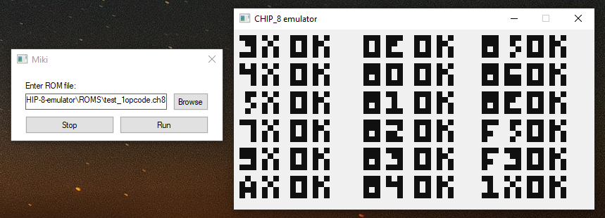

# CHIP8 emulator

This solution contains two projects:
1. CHIP-8 emulator 
1. Miki launcher

## CHIP-8 emulator
Chip-8 emulator written in C++ and SFML. It allows you to load any chip-8 rom file and handle whole emulation.
You should start emulation asynchronously in another thread, otherwise infinite game loop inside emulation, will block your programme.   

## Miki launcher
Small launcher written in C++ and WinApi. It allows you to select a rom file and run async emulation.
It requires the emulator to be compiled as library and linked to the project. 

